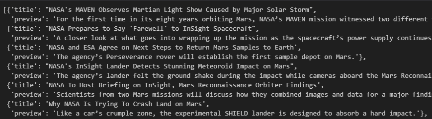
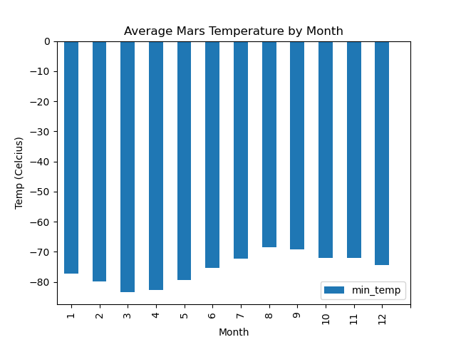
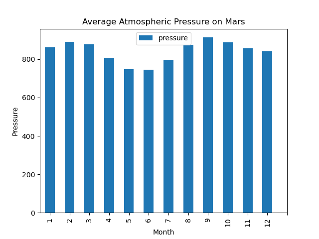
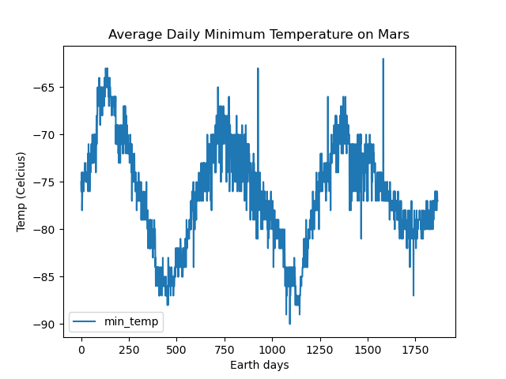

# web-scraping-challenge
Module 11 Challenge

This repository contains information on news articles and weather data for Mars.
__________________________________________________________________

## Repository Contents

- Mars folder, which contains:
    - Output folder containing one .csv file (table data) and three .png files (figures from analysis)
    - part_1_mars_news.ipynb - analysis of Mars news articles from web-scraping
    - part_2_mars_weather.ipynb - analysis of Mars weather data from web-scraping
- .gitignore file

__________________________________________________________________

## Part 1 Mars News

Website source : https://static.bc-edx.com/data/web/mars_news/index.html

This website was scraped and the news articles were saved as a list of dictionaries containing the article titles and previews. A portion of this output is shown below for reference.

__________________________________________________________________

## Part 2 Mars Weather

Website source: https://static.bc-edx.com/data/web/mars_facts/temperature.html

This website was scraped and the table was stored as a pandas DataFrame and exported into a .csv file in the "Output" folder within this repository.  The table was analyzed and the following questions were answered:

### 1. How many months exist on Mars?
- There are 12 months on Mars.

### 2. How many Martian (and not Earth) days worth of data exist in the scraped dataset?
- There are 1867 Martian days' worth of data in the dataset.

### 3. What are the coldest and the warmest months on Mars (at the location of Curiosity)?
- Month 3 has the coldest average temperature at -83.31 degrees Celcius.
- Month 8 has the hottest average temperature at -68.38 degrees Celcius.
- (*Please note, all recorded temperatures are below 0 degress Celcius, so -83 would be colder than -68*)

### 4. Which months have the lowest and the highest atmospheric pressure on Mars?
- Month 6 has the lowest average atmospheric pressure at 745.05.
- Month 9 has the highest average atmospheric pressure at 913.31.

### 5. About how many terrestrial (Earth) days exist in a Marian year?
- A visual estimate of minimum temperatures showed a distance between troughs of (475-1150), or roughly 675 Earth days in a Mars year.  
- Subtracting dates from the data showed a more specific value with a Mars year equaling 687 Earth days.

__________________________________________________________________

## RESOURCES

Class notes, activities, and slides.